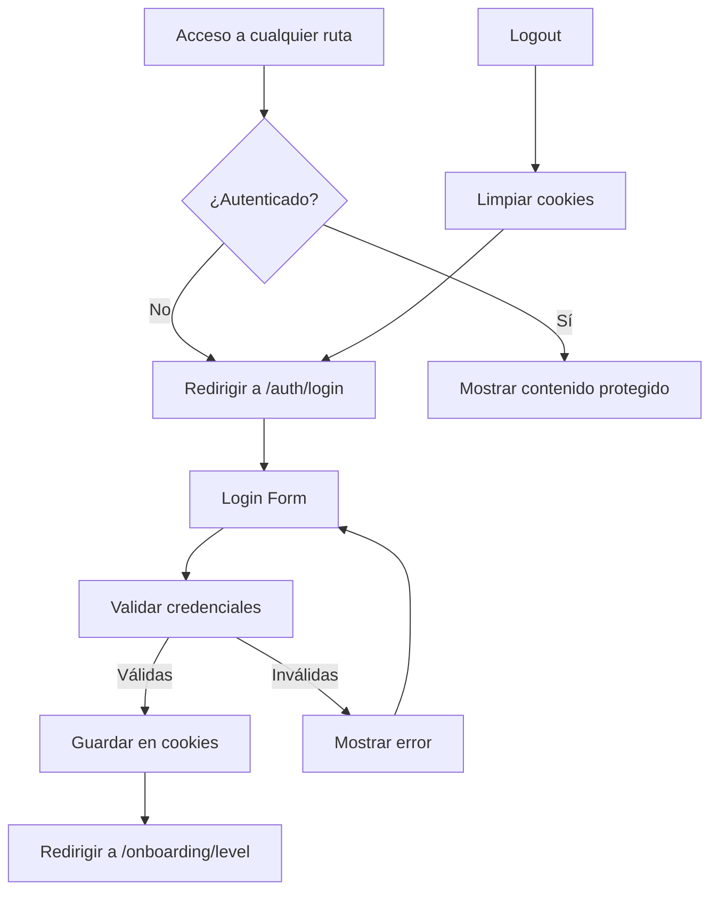

# 🔐 Sistema de Autenticación SSR - Simplificado

## 📋 Resumen del Sistema

Sistema de autenticación **Server-Side Rendering (SSR)** simplificado para una aplicación de aprendizaje con un solo usuario de prueba.

## 🎯 Reglas de Negocio

### ✅ **Usuario Único**
- **Un solo usuario de prueba** en la aplicación
- **No hay roles de usuario**
- **No hay registro de usuarios**
- **Credenciales fijas** para desarrollo y pruebas

### 🔑 **Credenciales de Prueba**
```
Email: test@example.com
Password: 12345678
```

## 🔧 Cambios Principales

### 1. **Sistema de Autenticación Simplificado**
- **Archivo**: `src/utils/ssrAuthUtils.ts`
- **Usuario único**: `TEST_USER` con credenciales fijas
- **Registro deshabilitado**: Solo permite login con el usuario de prueba
- **Validación UUID**: Arreglada para aceptar string simple

### 2. **Páginas Actualizadas**

#### ✅ Login (`src/pages/auth/login.astro`)
- Formulario POST procesado server-side
- Validación con credenciales del usuario de prueba
- Placeholders con las credenciales correctas
- Eliminado enlace de registro
- Información de prueba visible

#### ❌ Registro (`src/pages/auth/register.astro`)
- **DESHABILITADO**: Redirige automáticamente al login
- El registro ya no está disponible

#### ✅ Logout (`src/pages/auth/logout.astro`)
- Funciona normalmente
- Limpia cookies y redirige al login

### 3. **Protección de Rutas**
- **Onboarding**: Protegido, requiere autenticación
- **Homepage**: Redirección automática según estado
- **Todas las rutas**: Verifican el usuario único

## 🚀 Cómo Usar

1. **Iniciar servidor**:
   ```bash
   npm run dev
   ```

2. **Acceder**: `http://localhost:4321`

3. **Login**: 
   - Email: `test@example.com`
   - Password: `12345678`

4. **Navegación**: Automática después del login

## 📊 Estado del Sistema

### ✅ Funcionando
- [x] Login con usuario único
- [x] Protección de rutas
- [x] Navegación con logout
- [x] Validación server-side
- [x] Manejo de errores
- [x] Estado preservado en formularios
- [x] Redirecciones automáticas

### ❌ Deshabilitado
- [x] Registro de usuarios
- [x] Múltiples usuarios
- [x] Roles de usuario
- [x] Gestión de usuarios

## 🔧 Arquitectura

```
SSR Simple Auth Flow:
1. Usuario accede → Redirect to Login
2. Login Form → Server validates against TEST_USER
3. Valid credentials → Save session in cookies
4. Invalid credentials → Show error, preserve form
5. Authenticated → Access to protected routes
6. Logout → Clear cookies, redirect to login
```

## 📝 Detalles Técnicos

### Usuario de Prueba
```typescript
const TEST_USER: User = {
  id: 'test-user-001',
  email: 'test@example.com',
  name: 'Test User'
};
```

### Validaciones
- **Email**: Debe ser exactamente `test@example.com`
- **Password**: Debe ser exactamente `12345678`
- **Cookies**: Almacenan datos del usuario
- **Zod**: Validación de esquemas

### Seguridad
- **Server-side validation**: Toda la lógica en el servidor
- **Cookies seguras**: Configuración apropiada
- **No localStorage**: Solo cookies server-side
- **Error handling**: Manejo de errores y limpieza

## 🎉 Beneficios

1. **Simplicidad**: Un solo usuario, sin complejidad
2. **Desarrollo rápido**: Credenciales fijas para pruebas
3. **SSR completo**: Sin JavaScript client-side
4. **Seguridad**: Validación server-side
5. **Mantenibilidad**: Código simple y directo

## 🔄 Flujo de Usuario



---

**Rama**: `feature/ssr-auth-refactor`
**Estado**: ✅ Simplificado y listo para uso
**Credenciales**: `test@example.com` / `12345678` 